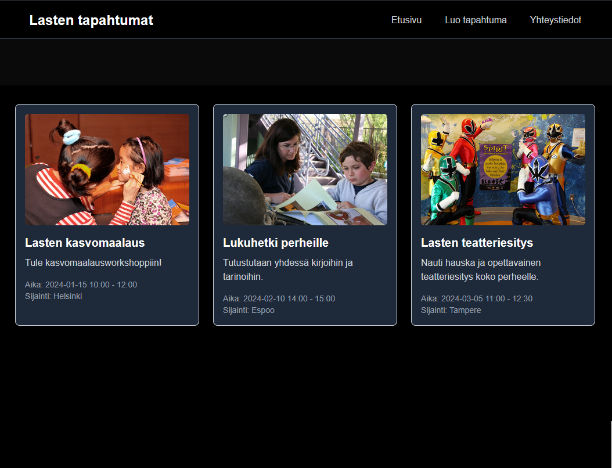

# Project Description

This is a Next.js exercise project for a children’s events webpage.  
At the moment, the site uses **placeholder event cards**, but the long-term goal is to evolve it into a fully functional platform.



## Planned Features

- User authentication to allow users to add, edit, and remove events
- A database for persistent event storage
- An admin dashboard to review and approve events in order to prevent spam or unsuitable content
- Future automation of content moderation
- Filtering and search functionality (e.g. by age group, date, location, or event type)
- A map integration to display event locations based on addresses

---

This is a [Next.js](https://nextjs.org) project bootstrapped with  
[`create-next-app`](https://nextjs.org/docs/app/api-reference/cli/create-next-app).

## Getting Started

First, run the development server:

```bash
npm run dev
# or
yarn dev
# or
pnpm dev
# or
bun dev
```
