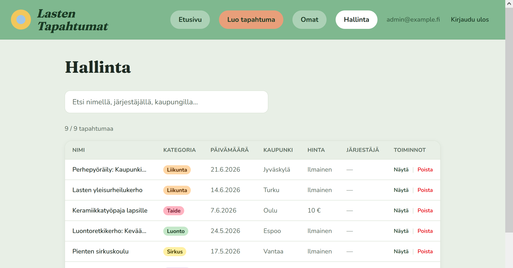

# Lasten tapahtumat

A children's events listing site built as an exercise in AI-assisted development — specifically using Claude Code as an agent to build a real Next.js project from scratch. The stack is Next.js 15 App Router, React 19, NextAuth v4, and Tailwind CSS v4.

Anyone can browse events. Only registered and logged-in users can create, edit, or delete their own events. Admins can manage all events.

Live demo: https://lasten-tapahtumat.onrender.com — free hosting, so give it a sec.  
Try it out with the test account: testi@example.com / testi123

---

## Features

- Browse and filter events by category, city, and free text
- Register an account and log in via a dropdown in the nav bar (no separate login page)
- Create, edit, and delete your own events
- Pick an illustration or upload your own image when creating an event
- Admin panel with full event table and search

## 

## Tech stack

| Concern       | Choice                                                             |
| ------------- | ------------------------------------------------------------------ |
| Framework     | Next.js 15 App Router                                              |
| Language      | TypeScript                                                         |
| Styling       | Tailwind CSS v4 ("Niitty/Meadow" design system, Fraunces + Nunito) |
| Auth          | NextAuth v4, credentials + bcrypt, JWT sessions                    |
| Database      | Supabase (PostgreSQL) via Prisma 7                                 |
| Image storage | Supabase Storage (`event-images` bucket)                           |
| Hosting       | Render (free tier)                                                 |
| Tests         | Playwright (e2e)                                                   |

---

## Pages

| URL             | Description                                            |
| --------------- | ------------------------------------------------------ |
| `/`             | Front page — filter bar + paginated event grid         |
| `/[id]`         | Event detail (2-column: content left, info card right) |
| `/[id]/edit`    | Edit event (owner or admin only)                       |
| `/register`     | Registration page                                      |
| `/create-event` | Create event (auth-protected)                          |
| `/dashboard`    | Logged-in user's own events + stats                    |
| `/admin`        | Full event table with search and delete (admin only)   |

---

## API routes

| Method   | Path                      | Purpose                                                   |
| -------- | ------------------------- | --------------------------------------------------------- |
| `POST`   | `/api/auth/[...nextauth]` | NextAuth signin / signout / session                       |
| `POST`   | `/api/register`           | Create new user account                                   |
| `POST`   | `/api/create-event`       | Create event (requires session)                           |
| `PUT`    | `/api/events/[id]`        | Edit event (owner or admin)                               |
| `DELETE` | `/api/events/[id]`        | Delete event (owner or admin)                             |
| `POST`   | `/api/upload-image`       | Upload image to Supabase Storage; returns `{ url }`       |
| `POST`   | `/api/reset`              | Wipe and reseed the database (protected by `RESET_TOKEN`) |

---

## Key files

```
src/
  types/types.ts              — Category and other non-DB types
  lib/
    auth.ts                   — NextAuth config
    categories.ts             — CATEGORIES array, CATEGORY_BY_KEY map, CITIES array
    dataFetching.ts           — all database access (fetchEvents, createEvent, etc.)
    prisma.ts                 — Prisma singleton client with PrismaPg driver adapter
  middleware.ts               — route protection
  components/
    header.tsx                — nav bar with login dropdown
    login-dropdown.tsx        — email/password form in a popover
    footer.tsx
    eventCard.tsx             — card used in the home grid
    event-form.tsx            — shared create/edit form
    event-actions.tsx         — Edit + Delete buttons on detail page
    home-browser.tsx          — client: filters + pagination
    providers.tsx             — SessionProvider wrapper
    ui/
      Button.tsx
      Pill.tsx                — category badge
      Input.tsx / Select.tsx / Textarea.tsx
      Illustrations.tsx       — IllustrationId type, Illustration component, IllustrationPicker
      ImageUploader.tsx       — file input → POST /api/upload-image → returns Supabase URL
```
